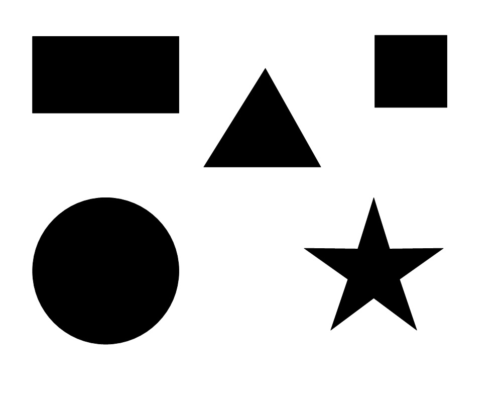
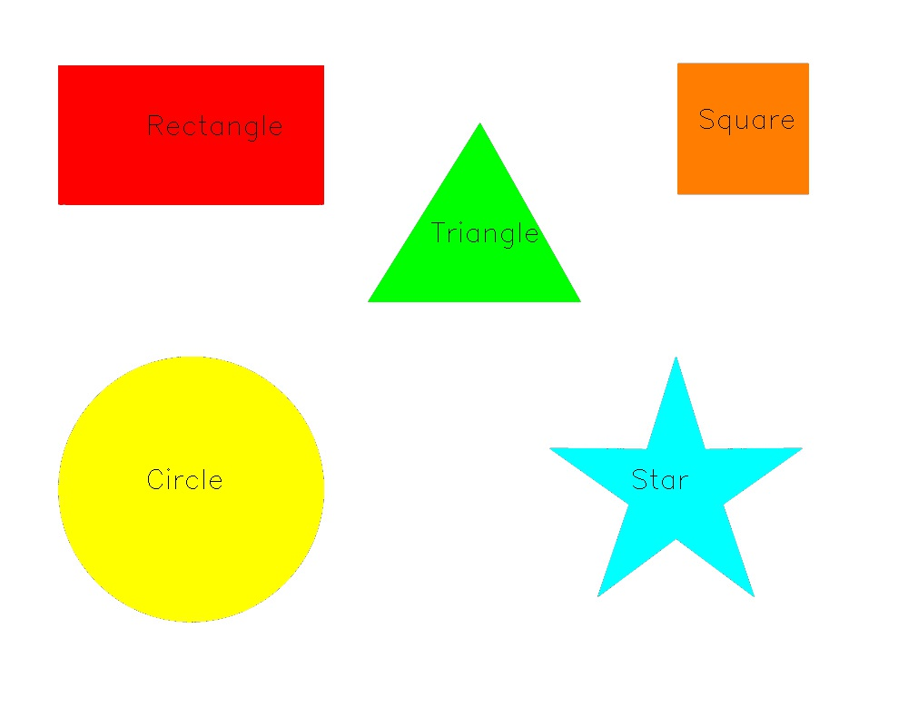

# Computer-Vision-Open-CV-play-ground
Computer-Vision-Open-CV-play-ground
<h1>content</h1>
<h2>Open_CV Basics</h2>
<ol>
  <li>Grayscale</li>
  <li>Histogram</li>
  <li>Draw line</li>
  <li>Draw rectangle</li>
  <li>Draw circle</li>
  <li>Draw polygon</li>
  <li>Write on image</li>
</ol>  
<h2>Image Manipulations</h2>
<ol>
  <li>Transformations, affine and non-affine</li>
  <li>Translations</li>
  <li>Rotations</li>
  <li>Scaling, Re-sizing and Interpolations</li>
  <li>Image Pyramids</li>
  <li>Cropping</li>
  <li>Arithmetic Operations</li>
  <li>Bitwise Operations (masking)</li>
  <li>Blurring</li>
  <li>Sharpening</li>
  <li>Thresholding (Binarization)</li>
  <li>Dilation, Erosion, Opening and Closing</li>
  <li>Edge Detection and Image Gradients</li>
  <li>Perspective and Affine Transforms</li>
</ol>  
<h2>Live sketch App</h2>
  
<h2>Contours</h2>
<ol>
  <li>Identify Contours</li>
  <li>Sorting Contours</li>
  <li>Approximating Contours and Finding their Convex Hull</li>
  <li>Matching Contour Shapes</li>
  <li>Line Detection</li>
  <li>Blob Detection</li>
</ol>  
<h2>Shape Detection</h2>

  
 

<h2>Circle Counting</h2>

    
 
